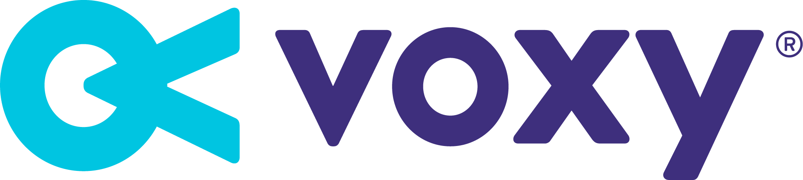
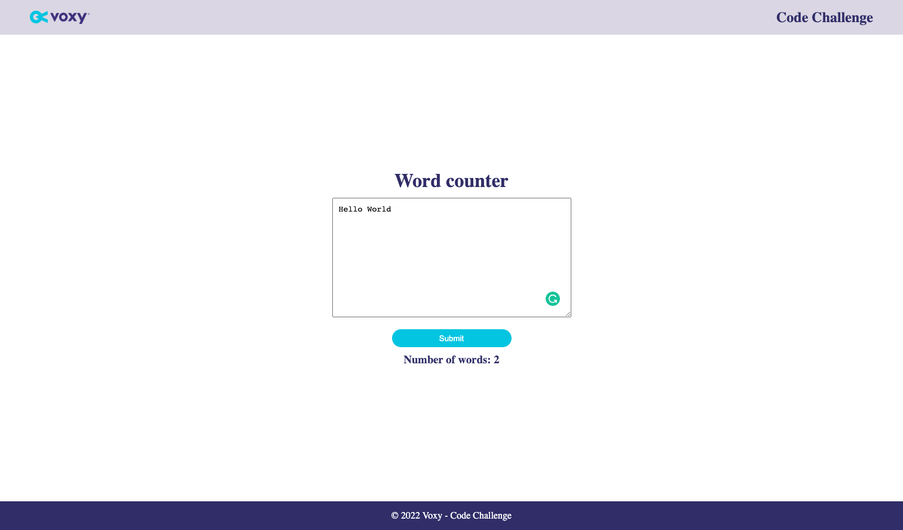

<div align="center">
    
</div>

<p align="center">
  <a href="#-technologies">Technologies</a>&nbsp;&nbsp;&nbsp;|&nbsp;&nbsp;&nbsp;
  <a href="#-getting-started">Getting started</a>&nbsp;&nbsp;&nbsp;|&nbsp;&nbsp;&nbsp;
  <a href="#-project">Project</a>&nbsp;&nbsp;&nbsp;|&nbsp;&nbsp;&nbsp;
  <a href="#-license">License</a>
</p>

<p align="center">
  
  
  

  
</p>

<br>

<div align="center">
  
</div>

---

## 🧪 Technologies

This project was developed using the following technologies:

-   [Django](https://www.djangoproject.com/)
-   [Django Rest Framework](https://www.django-rest-framework.org/)
-   [Vue Js](https://vuejs.org/)
-   [Docker](https://www.docker.com/)

## 🚀 Getting started

Clone the project and access the folder

```bash
$ git clone https://github.com/victortxc/voxy-challenge.git && cd voxy-challenge
```

Follow the steps below

```bash
# Make sure to create a .env file inside backend folder with your django secret key
$ SECRET_KEY=YOUR_SECRET_KEY

# Make sure you have docker running in your machine

# Start the project
$ docker-compose up --build
# Access: http://localhost:3000
```

Testing

```bash

# Test the Django project
$ docker-compose run --rm backend sh -c "python manage.py test"
```

Linting

```bash

# Check for lintings errors in the Django project
$ docker-compose run --rm backend sh -c "flake8"
```

## 💻 Project

App to count the number of words in a text 💬

## 📝 License

This project is licensed under the MIT License. See the [LICENSE](LICENSE.md) file for details.

